# Home Automation Control System

## Industry:  
**Smart Home Technology**  

---

## Technologies Used:  
- **Frontend:** Flutter  
- **Backend:** RESTful APIs  
- **Authentication:** Firebase  
- **Real-time Communication:** WebSocket  

---

## My Contribution  

- **Project Leadership:** Managed the overall project lifecycle, including feature planning, task delegation, and progress tracking.  
- **Frontend Development:** Designed and implemented the Flutter-based UI/UX, ensuring an intuitive user experience.  
- **Backend Integration:** Integrated RESTful APIs and WebSocket for seamless real-time communication.  
- **Authentication:** Configured and implemented Firebase for secure user authentication and data management.  
- **Testing and Optimization:** Conducted unit and integration testing to ensure the system’s stability and scalability.  
- **Energy Management Module:** Developed algorithms to monitor energy consumption and provide optimization recommendations.  

---

## Project Overview  
The Home Automation Control System is a comprehensive mobile application designed to help users manage and monitor various smart home devices. Built with Flutter, the app enhances convenience, security, and energy efficiency in home environments.  

---

## Key Features  

### **1. User Authentication and Profile Management**  
- Secure login with role-based access control.  

### **2. Device Control**  
- Manage smart devices, including lights, thermostats, security cameras, and door locks.  

### **3. Real-time Monitoring**  
- View live feeds from security cameras.  
- Receive instant status updates from sensors.  

### **4. Notifications and Alerts**  
- Get push notifications for critical events, such as security breaches or smoke detection.  

### **5. Energy Management**  
- Monitor energy consumption.  
- Receive recommendations to optimize usage.  

### **6. Voice Control Integration**  
- Compatible with Amazon Alexa and Google Assistant for voice commands.  

### **7. Mobile Access**  
- Fully responsive mobile app available for both Android and iOS.  

---

## Business Challenge  
The project faced several challenges:  

1. **Integration of Multiple Devices:** Achieving seamless connectivity for a variety of smart home devices from different manufacturers.  
2. **Real-time Data Communication:** Ensuring instant and reliable communication between the mobile app and smart devices for live updates.  

---

## Solution Delivered  

### **1. Unified Device Management**  
- Developed an integrated system for controlling all smart home devices from a single app interface.  

### **2. Real-time Communication**  
- Used WebSocket to enable instant data updates and control interactions between the mobile app and smart devices.  

---

## Implementation Highlights  

### **1. User Interface Development**  
- Designed a dynamic and responsive app using Flutter for a consistent experience on Android and iOS.  

### **2. Component Design**  
- Developed components for:  
  - Device control  
  - Real-time monitoring  
  - User management  

### **3. Real-time Data Integration**  
- Implemented WebSocket for immediate status updates and seamless device interaction.  

### **4. User Authentication**  
- Used Firebase authentication to provide secure login and role-based access.  

---

## Outcomes  

### **1. Enhanced User Experience**  
- Delivered a responsive interface that simplifies smart home management.  

### **2. Improved User Engagement**  
- Created a visually appealing UI, increasing user satisfaction.  

### **3. Real-time Interaction**  
- Provided instant feedback and control through real-time updates.  

### **4. Accessibility**  
- Enabled users to control smart home devices from anywhere through mobile devices.  

This system revolutionizes how users interact with smart devices, promoting efficiency, security, and convenience.  

---

## Snapshots  

| Light Theme | Dark Theme |
|-------------|------------|
| 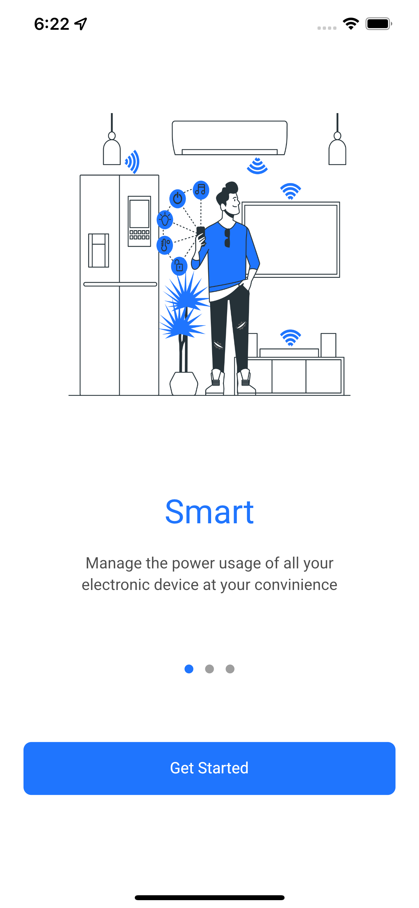 | 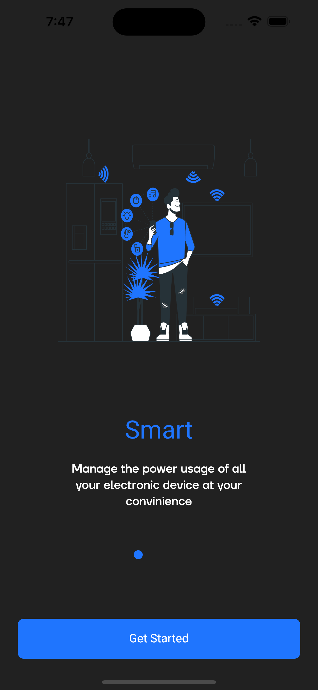 |
| 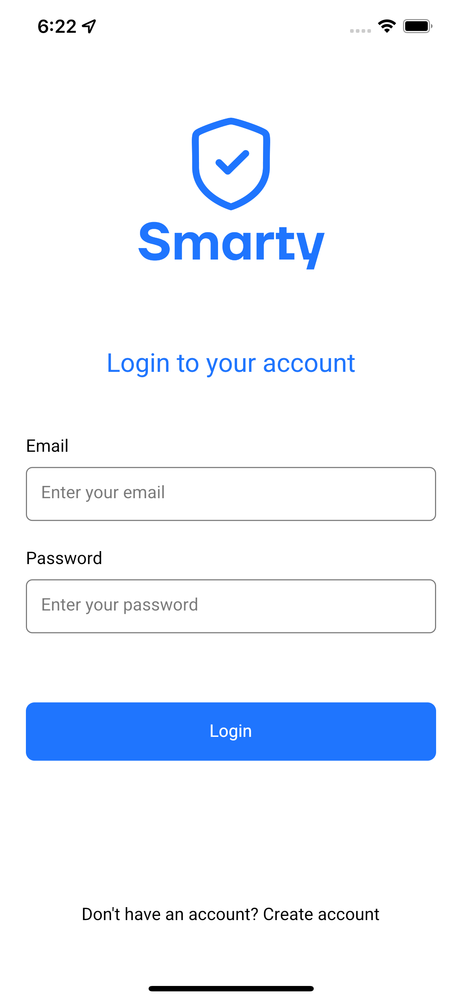 | 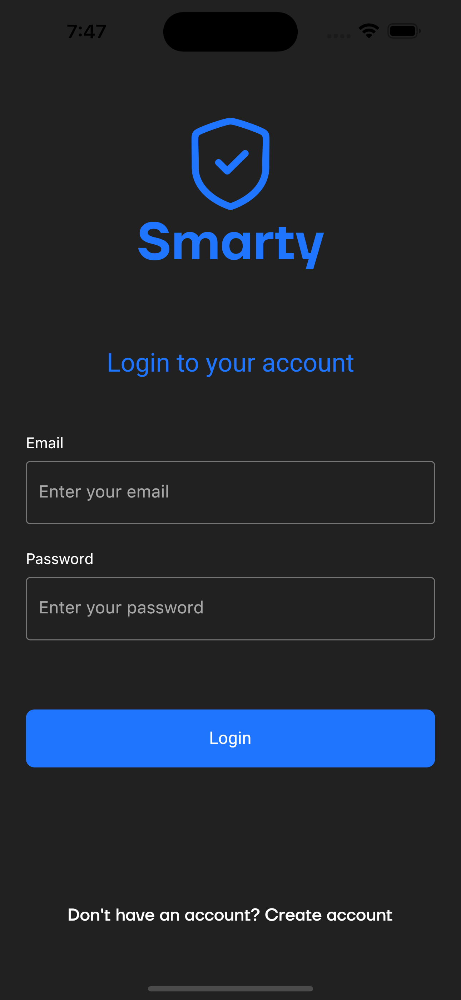 |
| 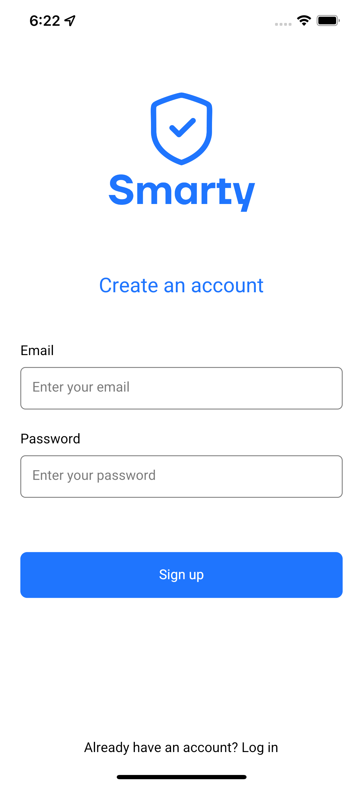 | 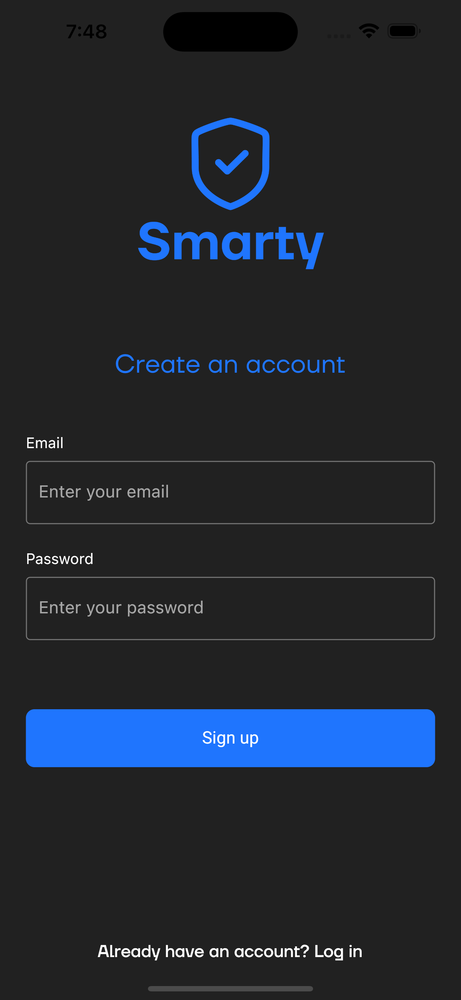 |
| 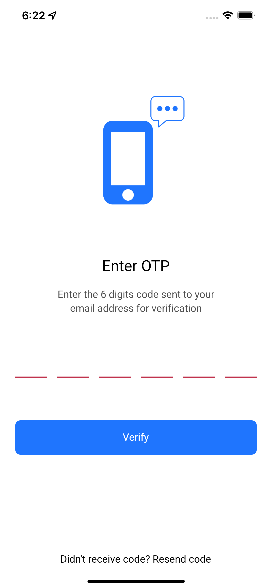 | 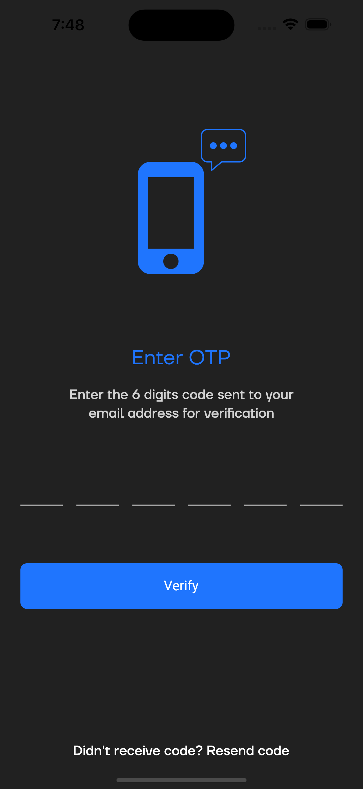 |
| 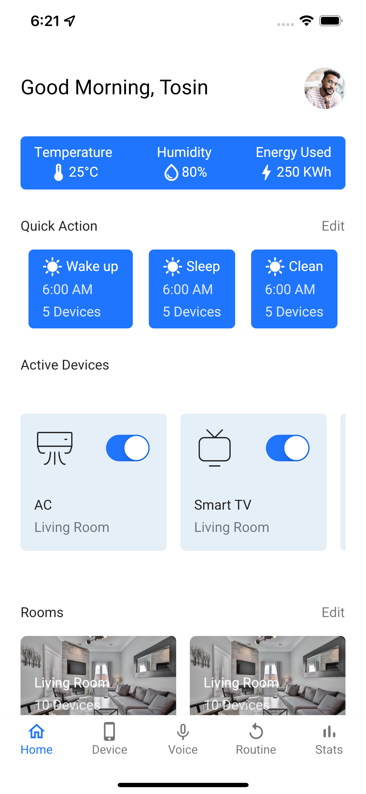 | 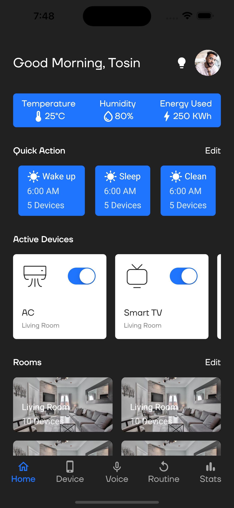 |
| 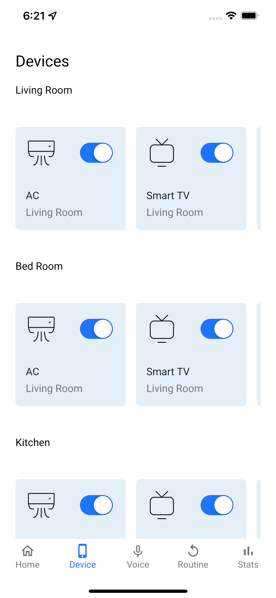 | 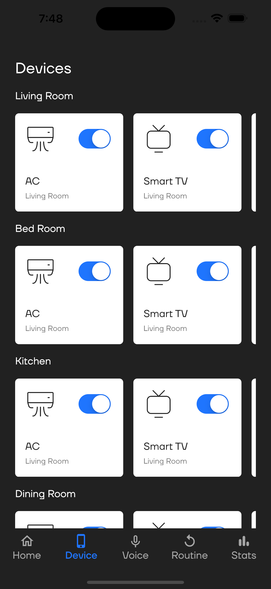 |
| 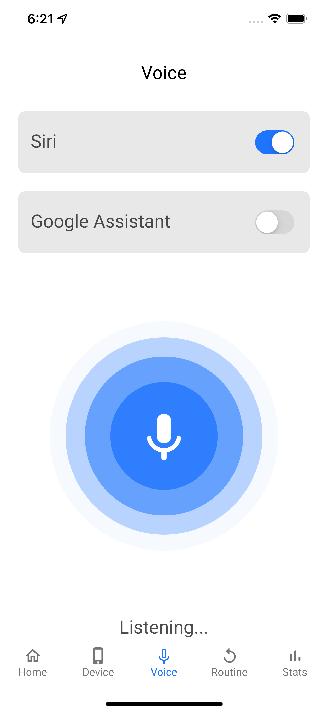 | 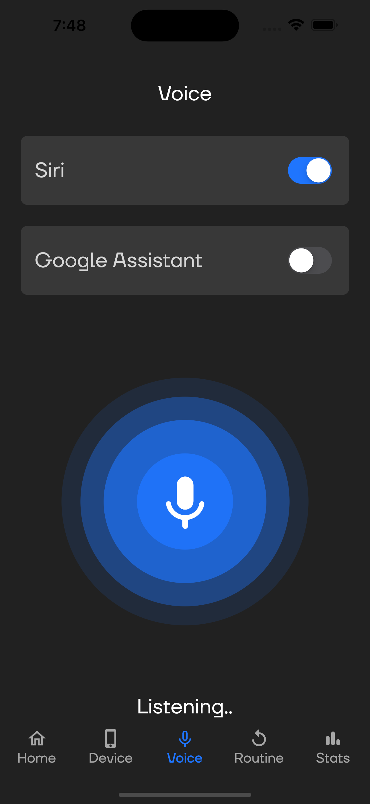 |
| 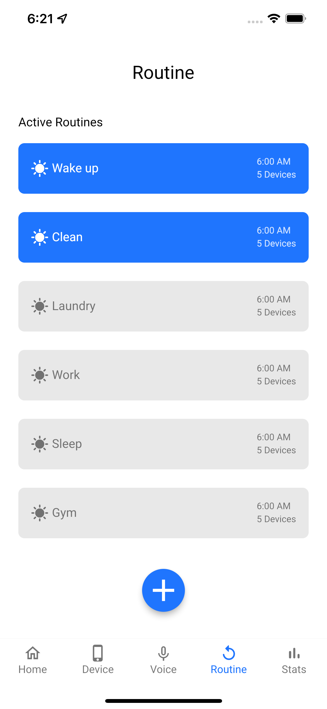 | 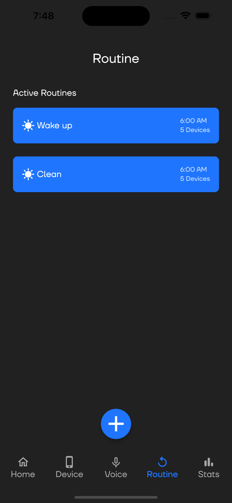 |

---

