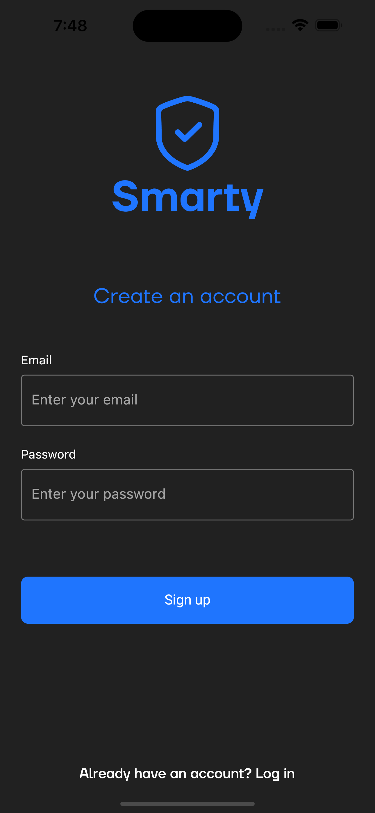
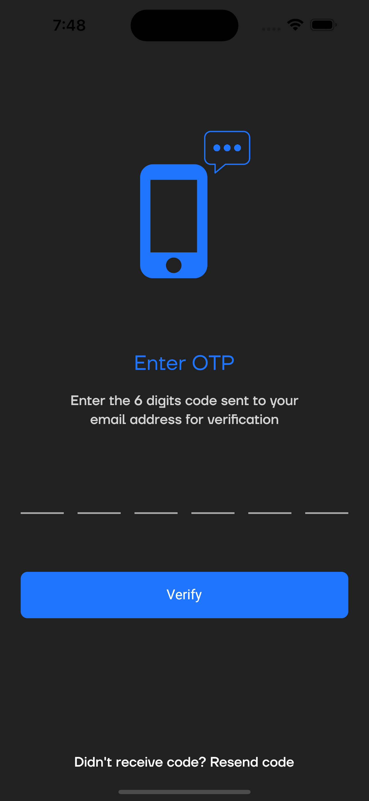
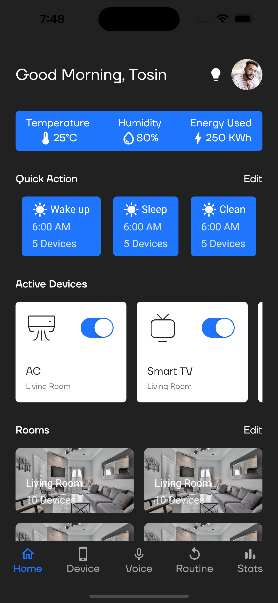
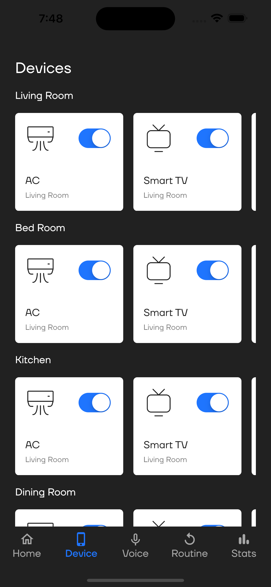
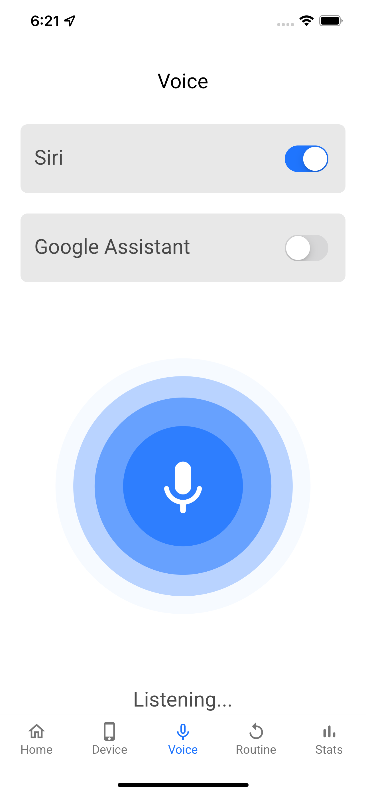
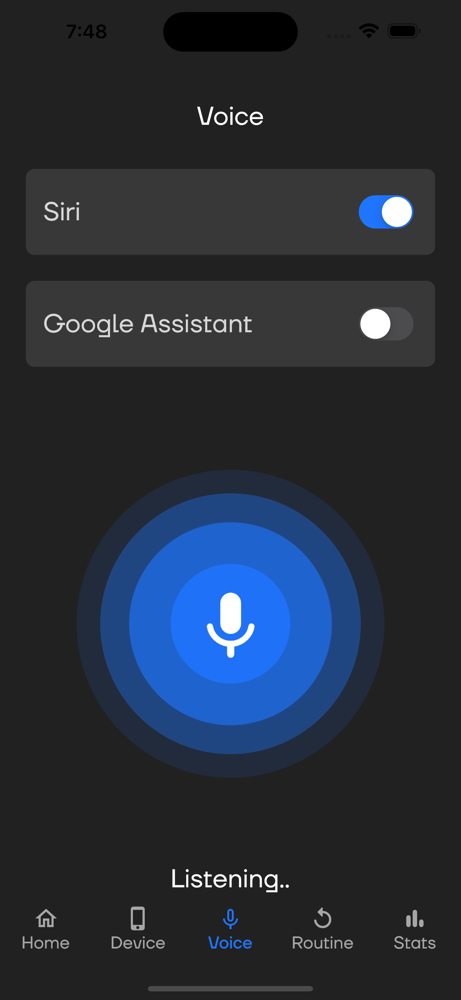

# Home Automation Control System

### Industry:
Smart Home Technology

### Technologies Used:
- **Frontend**: Flutter
- **Backend**: RESTful APIs
- **Authentication**: Firebase
- **Real-time Communication**: WebSocket

## Project Overview
The **Home Automation Control System** is a comprehensive mobile application that enables users to manage and monitor various smart home devices. Built with Flutter, this system enhances convenience, security, and energy efficiency within the home environment.

### Key Features:
- **User Authentication and Profile Management**: 
  - Secure login with role-based access control.
  
- **Device Control**: 
  - Manage smart devices including lights, thermostats, security cameras, and door locks.
  
- **Real-time Monitoring**: 
  - View live feeds from security cameras and receive status updates from sensors.
  
- **Notifications and Alerts**: 
  - Receive push notifications for critical events such as security breaches or smoke detection.
  
- **Energy Management**: 
  - Monitor energy consumption and receive recommendations to optimize usage.
  
- **Voice Control Integration**: 
  - Compatible with Amazon Alexa and Google Assistant for voice command functionality.
  
- **Mobile Access**: 
  - Accessible via a responsive mobile app on both Android and iOS.

## Business Challenge
The development of the Home Automation Control System faced several challenges:
- **Integration of Multiple Devices**: Ensuring seamless connectivity and control of various smart home devices from different manufacturers.
- **Real-time Data Communication**: Maintaining instant communication between the mobile app and the smart devices for live updates and controls.
  
## Solution Delivered
To address these challenges, the following solutions were implemented:
- **Unified Device Management**: Developed a system that integrates various smart home devices, allowing users to control them from a single interface.
- **Real-time Communication**: Utilized WebSocket for instant updates and interactions between the mobile application and smart devices.

## Implementation Highlights
- **User Interface Development**: 
  - Created a dynamic and responsive mobile app using Flutter to ensure a consistent user experience across Android and iOS devices.
  
- **Component Design**: 
  - Designed and implemented components for device control, real-time monitoring, and user management.
  
- **Real-time Data Integration**: 
  - Integrated WebSocket for real-time communication, enabling immediate status updates of devices and sensors.
  
- **User Authentication**: 
  - Implemented secure login and user management using Firebase authentication services.

## Outcomes
- **Enhanced User Experience**: 
  - Developed an intuitive and responsive interface, simplifying the management of smart home devices.
  
- **Improved User Engagement**: 
  - Created a visually appealing UI, leading to increased user satisfaction and engagement.
  
- **Real-time Interaction**: 
  - Provided immediate feedback and control through real-time data updates, enhancing the user experience.
  
- **Accessibility**: 
  - Ensured full accessibility on mobile devices, allowing users to control their home environment from anywhere.

The Home Automation Control System revolutionizes the way users interact with their smart home devices, promoting efficiency, security, and convenience in daily life.

## Snapshots

| Light Theme | Dark Theme |
|-------------|------------|
|  |  |
|  |  |
|  |  |
|  |  |
|  |  |
|  |  |
|  |  |
|  |  |

---

